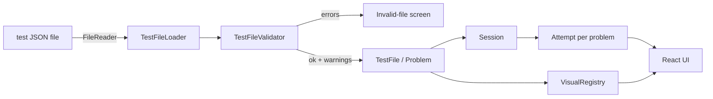

# Architecture

## Shape of the product



Everything runs in the page. `npm run build` inlines the app, CSS and KaTeX fonts into one `dist/index.html`. A build-only Content-Security-Policy (`connect-src 'none'`, no `unsafe-eval`) guarantees the delivered page makes no network requests and never evaluates code.

## Source layout

```
src/
  contract/     the file contract
    test-file.local.v1.schema.json   frozen v1 contract; compiled to generated/schemaValidatorV1.js
    test-file.local.v2.schema.json   composed from v1 by scripts/compose-v2-schema.mjs; compiled to …V2.js
    types.ts                          TS mirror of both schemas (normalized TestFileJson + raw v2 types)
    contracts.ts                      TestFileContract → ContractV1 / ContractV2, ContractRegistry, TestFileValidator
    validate.ts                       SchemaCheck, ValidationReport, worked-problem ValidationRule subclasses
    rulesV2.ts                        v2 rules: activities, ids, visual assets, callouts, choice, matching, recall, rapid
    imageInfo.ts                      PNG/JPEG detection and dimensions (shared with scripts/embed-image.ts)
    loader.ts                         FileReader → size check → JSON.parse → validate/normalize → TestFile
  engine/       no React; unit-tested in Node
    expression.ts   ExpressionNode class hierarchy (the only calculation mechanism)
    operations.ts   Operation subclasses + MathOperator strategies + AutoNamer
    variables.ts    Variable (stable id, renamable name/symbol) + VariableStore
    testFile.ts     TestFile, Problem, OperationCatalog (the Add Step menu)
    attempt.ts      Attempt: timer, variables, steps, final answer, reveal state
    timer.ts        StudyTimer state machine
    session.ts      Session: one loaded test, attempts per problem, active problem
    authoredPath.ts AuthoredStep subclasses; AuthoredPath replays the answer key
    review.ts       ReviewMatcher (✓ "you reached this")
    attemptExport.ts AttemptExporter (Download Attempt JSON)
    format.ts       number/unit/LaTeX display helpers
    observable.ts   change notification for React
    quickcheck/     v2 visual rapid checks
      items.ts      QuickCheckItem → SingleChoice / TrueFalse / Matching / Recall (scoring, answers)
      run.ts        QuickCheckRun (card phases, feedback modes), CardTimer, RunSummary, retry
  render/       visual adapters
    visuals.tsx     VisualAdapter subclasses + VisualRegistry
    diagram2d.tsx   Primitive2D subclass per primitive kind
    scene3d.tsx     Camera, Object3D subclass per object kind, SceneProjector
    itemVisual.tsx  ItemVisualAdapter → typed scene / image / pair; aspect-locked callout overlay
    Latex.tsx       KaTeX wrapper; SvgLabel.tsx for diagram text
  ui/           React function components that delegate to the classes above
    quickcheck/     QuickCheckView, ItemControls, QuickCheckSummary
  examples/     bundles the three reference fixtures from docs/handoff
```

## Class hierarchies

Every variable part of the system is a small class hierarchy with a registry keyed by the test file's discriminator, so adding a kind means adding a subclass and one registry entry:

| Base | Subclasses | Registry key |
| --- | --- | --- |
| `ExpressionNode` | `SlotNode`, `NumberNode`, `OperatorNode` → `Add/Subtract/Multiply/Divide/Power/Negate/Abs/SqrtNode`, `TrigNode` → `Sin/Cos/Tan/Asin/Acos/AtanNode` (v2) | `op` |
| `Operation` | `FormulaOperation`, `BasicMathOperation`, `ConversionOperation`, `DerivativeOperation`, `FinalAnswerOperation` | action group |
| `MathOperator` | `Add/Subtract` (same-unit), `Multiply`, `Divide`, `Power`, `Sqrt` | `mathOperation` |
| `AuthoredStep` | `AuthoredFormula/BasicMath/Conversion/Derivative/FinalAnswerStep` | solution step `kind` |
| `TestFileContract` | `ContractV1` (frozen), `ContractV2` | `apiVersion` |
| `ValidationRule` | `UniqueIdRule`, `FormulaExpressionRule`, `ReferenceRule`, `BindingRule`, `GivenValueRule`, `AuthoredValueRule`; v2: `ActivityPresenceRule`, `QuickCheckIdRule`, `VisualAssetRule`, `CalloutRule`, `SingleChoiceRule`, `MatchingRule`, `RecallRule`, `RapidVisualRule` | (ordered list per contract) |
| `VisualAdapter` | `LatexVisualAdapter`, `Diagram2DAdapter`, `Scene3DAdapter` | visual `type` |
| `Primitive2D` | one per `diagram2d/v1` kind (10) | primitive `kind` |
| `Object3D` | `Axes`, `Point`, `Segment` (line/arrow), `Plane`, `SolidObject` → `Box` (solid or wireframe)/`Cylinder`, `Sphere`, `Label` | object `kind` |
| `QuickCheckItem` | `SingleChoiceItem`, `TrueFalseItem`, `MatchingItem`, `RecallItem` | item `type` |
| `ItemVisualAdapter` | `TypedSceneAdapter`, `ImageAdapter`, `PairAdapter` | item visual `kind` |

The same `Operation` classes serve Amy's steps and the authored answer key: `AuthoredStep.createOperation()` returns the operation Amy would use, and `AuthoredPath` runs it. The answer-key check and the review therefore use exactly the code paths the learner uses.

## Data flow of one step

1. `AddStep` (UI) lists `problem.catalog().groups()` → operations → `operation.inputs()`.
2. Each input dropdown lists `attempt.choicesFor(slot.acceptsSymbolic)`, grouped as Givens / Constants / My results.
3. **Calculate** calls `attempt.addStep(operation, bindings, name)`:
   - resolves variable ids and rejects symbolic values for numeric inputs
   - `operation.execute(bound, name)` returns output variable data (or throws `EvaluationError`)
   - stores outputs in `VariableStore` with new `var_####` ids tied to the step
   - records `operation.unitHints(bound)`
   - advances the `AutoNamer` counter
4. `Attempt` notifies, and every subscribed component re-renders (`useObservable`).

## Validation pipeline

`TestFileValidator` picks the contract named by the file's `apiVersion` (`ContractRegistry`), then that contract runs:

1. `SchemaCheck`: its build-time-compiled Ajv validator, with errors simplified to one readable message per JSON path.
2. Normalization (v2: missing `formulaSheet`/`conversions`/`problems`/`quickCheckSets` become empty lists).
3. Its semantic rules, only if the schema passed.
4. `AuthoredValueRule`, only if there are no errors. It replays every solution step and raises a **warning** when a stored `output.value` disagrees with the recomputed value.

Errors block opening the file. Warnings open it and show a notice.

## Quick-check run (v2)

`Session.startQuickCheck(setId)` creates a `QuickCheckRun` over the set's items in authored order. Each card moves through `answering → feedback` (immediate mode) or straight to the next card (end mode); recall goes `answering → recallRevealed` and is then self-marked. In `rapidVisual` sets, `CardTimer` counts down `displaySeconds`, and `checkExpiry()`, called on UI ticks and on submit, records `unanswered` and moves to `expired`, where Amy picks Show answer (`expiredAnswer`) or Next card. `RunSummary` groups the records; `retry()` builds round N+1 from the misses, unanswered and Review items.

## Tests

- `tests/unit`: Vitest in Node covering expressions, operations, attempts/timer/session, validator rules, loader, answer-key replay, review matching, export, renderers, and schema-copy identity.
- `tests/e2e`: Playwright against `file://…/dist/index.html` with no network, one test per SOW acceptance criterion: `acceptance.spec.ts` (v0.2, AC1–AC10) and `rapidChecks.spec.ts` (v0.3 delta §8). CI runs them in Chromium, Firefox and WebKit.
