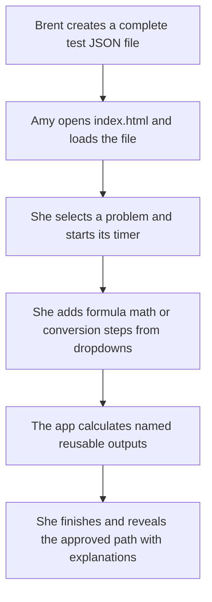

# Guided Test Prep Local Offline Statement of Work

## Project decision

Build a small, local-first guided test-prep application for Amy. Brent will generate complete test files outside the application from homework, formula sheets, and practice exams. The application does **not** generate problems, host content, manage users, or call an AI service.

The delivered application must run when Amy double-clicks its local `index.html` file. It must work without a server, a sign-in, an account, a database, an internet connection, or a command line. Amy loads a local JSON test file from the home screen, works each timed problem with structured dropdown steps, and then reveals an author-provided correct path with explanations.

There is no server-side "backend" in this scope. The local browser runtime is the entire product. The file API is the product boundary.

## Intended use flow



1. Brent asks ChatGPT to generate a test file that conforms to the supplied JSON schema. The file includes the questions, formula sheet, diagrams, calculations, answer path, and teaching explanations.
2. Brent saves that output as a `.json` file and gives it to Amy. Correcting or adding a problem means replacing or creating a JSON file, not changing the app.
3. Amy double-clicks `index.html`, chooses **Load Test**, and selects the JSON file. A local file picker is required because a double-clicked page cannot reliably read a neighboring JSON file by itself.
4. She chooses a problem and selects **Start**. The elapsed timer is visible during the attempt.
5. She uses **Add Step** to choose a formula-sheet item, a basic math operation, a conversion, or a pre-authored derivative action. Each value comes from a dropdown of givens and prior outputs whenever possible.
6. The runtime calculates the result, creates a reusable variable, and adds it to later dropdowns. Amy can rename its displayed name and symbol at any time.
7. She selects **Finish and reveal path**. The timer stops. The app shows the expected path one step at a time or all at once, including the rationale for why that operation comes next.

## Learner experience

### Home and test runner

The home screen has only three primary actions:

- **Load Test**: choose a local JSON test file with the native file picker or drag and drop it.
- **Use Included Examples**: open either supplied reference test without needing a file: ENGR 206 or Mechanics of Materials.
- **Open Problem**: choose a question from the loaded test.

There is no sign-in, user list, profile chooser, upload service, publish state, account history, or cloud sync. Loading a new test starts a new local session. Saving long-term attempt history is out of scope; an optional **Download Attempt** JSON export is acceptable, but not required.

### Timed problem flow

When Amy opens a problem, she sees the prompt, givens, target, diagram, formula sheet, timer, and an empty work list. The timer starts only when she presses **Start**. It can be paused or ended. Selecting **Finish and reveal path** stops it permanently for that attempt.

The timer is a study aid, not a proctoring feature. The app stores elapsed time only in the active browser page; it does not need a user account or tamper protection.

### Add Step workflow

The work area is a guided calculator, not a free-form algebra editor.

1. Select **Add Step**.
2. Select one action group: **Formula sheet**, **Basic math**, **Unit conversion**, **Derivative**, or **Final answer**.
3. Select a formula or operation from a dropdown.
4. Bind its inputs from dropdowns. The choices are all original givens, named constants, and outputs created in earlier steps.
5. Confirm or edit the automatically suggested output name and symbol.
6. Select **Calculate**. The app calculates the value, records the step, and adds the output to future dropdowns.

Most entries must be dropdowns. The only routine text fields are the human-readable output name and optional symbol. A small numeric-constant action is allowed for cases where a problem requires an explicit `2`, `pi`, or other declared constant; it must create a named variable, not an untracked free-form expression.

### Variables and automatic names

Every number or symbolic result is a variable. The runtime assigns an immutable internal ID such as `var_0004`, plus editable display fields. The internal ID never changes when Amy renames a value, so earlier steps remain intact.

| Situation | Automatic label | Learner may change | Reusable later |
| --- | --- | --- | --- |
| Given in test file | Author-supplied label, such as `Source current` | Display name and symbol | Yes |
| Formula result | Formula output plus counter, such as `Voltage 1` and `V_1` | Display name and symbol | Yes |
| Basic math result | Operation output plus counter, such as `Result 2` | Display name and symbol | Yes |
| Conversion result | Converted quantity plus counter, such as `Resistance 1` | Display name and symbol | Yes |
| Pre-authored derivative | Expression-derived label, such as `dv/dt 1` | Display name and symbol | Yes, as symbolic result |

Every future input dropdown displays the editable label, symbol, numeric value if available, and unit. Example: `Voltage across R1 (V_R1) = 12 V`.

### Correct path and explanations

The test file contains a recommended solution path. The app does not need to discover arbitrary valid algebraic alternatives or run an AI tutor.

After Amy finishes, the review view displays:

- her timed work list and outputs;
- the recommended sequence, revealed one step at a time or all at once;
- the formula or operation used at each recommended step;
- the values selected for that step;
- the calculated result with units; and
- teaching copy written in the test file.

Each solution step must contain these explanation fields:

| Field | Purpose |
| --- | --- |
| `whyNow` | Why this is the next dependency, for example: "We need the slope at this instant, so differentiate position before substituting time." |
| `whatToNotice` | The cue in the wording or diagram that points to the method. |
| `whyThisOperation` | Why the selected formula, math operation, conversion, or derivative is appropriate. |
| `inputMeaning` | What each input represents and where it came from. |
| `resultUse` | What the output unlocks in the next step. |
| `commonMistakes` | Optional, bounded mistakes relevant to this problem. |

This gives Amy an actual guided explanation in the same step format without making a network-dependent chatbot a requirement. A future conversational coach can be added later, but it is not part of this contract.

## Local test-file API

### File loading rules

- The app loads a file selected by the learner with the browser `FileReader` API. It must not use `fetch()` to read a sibling file, because `file://` browser rules make that unreliable.
- A test is a single JSON file. It contains all runtime text, LaTex, formula data, diagrams, answers, and explanations. No source PDFs, images, hosted URLs, or external assets are required at runtime.
- The runtime validates the file before opening it and shows a readable error with the failing JSON path if the file is malformed.
- The app must not use a CDN, API key, server call, analytics call, or local web server.

### Test file shape

The supplied schema is `guided-test-file.local/v1`. A test file contains a reusable formula sheet, allowed unit conversions, and fully realized problems. It is intentionally a **test file**, not a parameterized problem generator or a publishable profile.

```json
{
  "apiVersion": "guided-test-file.local/v1",
  "id": "engr206-voltage-divider-practice-01",
  "title": "ENGR 206 Voltage Divider Practice",
  "formulaSheet": ["...formula cards..."],
  "conversions": ["...allowed conversions..."],
  "problems": ["...complete, already-generated questions..."]
}
```

Each problem includes:

- prompt text and LaTex;
- fixed givens and target;
- a declarative visual specification;
- the permitted formula IDs and conversion IDs;
- optional pre-authored derivative actions; and
- a complete, ordered `solutionPath` with expected bindings, outputs, and teaching copy.

### Subject-neutral reference fixtures

The runtime must not branch on a course or subject name. The supplied ENGR 206 and Mechanics of Materials files both use the same `guided-test-file.local/v1` contract, formula expression tree, variable model, solution-step types, and visual adapters. The Mechanics of Materials file introduces **no** mechanics-specific API, custom calculator operation, or new renderer type.

| Fixed Mechanics of Materials problem | Existing contract elements it exercises | Why it belongs in this scope |
| --- | --- | --- |
| Double-lap bolt group: average shear stress | Formula cards, a declared kN-to-N conversion, reusable outputs, and `diagram2d/v1` SVG primitives | The learner chooses formula inputs from dropdowns, then the review explains why two shear planes per bolt are included before calculating stress. |
| Uniform axial bar: elongation and normal strain | Formula cards, declared kN-to-N / m-to-mm / GPa-to-MPa conversions, reused length output, and `scene3d/v1` primitives | It proves the same local calculator can connect compatible units, name outputs, reuse elongation, and display a static structural view without a CAD modeler. |
| Bilinear shear stress-strain unloading: residual strain | Formula cards, built-in add/subtract actions, reusable outputs, and a `diagram2d/v1` stress-strain graph | It proves the review path can explain dependencies: reach yield on the elastic slope, add the post-yield increment, then subtract elastic recovery to identify residual strain. |

These are fixed client-provided test fixtures, not a request for the contractor to create, randomize, or derive new mechanics problems. They demonstrate that the file format remains polymorphic across subjects while the runtime stays generic.

### Formulas and calculations

A formula card contains its LaTex, named input slots, output definition, teaching notes, and a declarative expression tree. The browser supports a small fixed set of numeric operations: add, subtract, multiply, divide, power, negate, absolute value, and square root. The test file can combine them into a formula expression tree.

The engine must not execute JavaScript, Python, or another arbitrary expression from a test file. This is not an authentication or security project; it is simply the smallest reliable way to make generated JSON portable and keep a malformed test from breaking the local app.

Basic math is a built-in dropdown of the same operations. Unit conversions are declared by a finite factor and source/target unit in the test file. Version one does not need automatic dimensional analysis beyond displaying units and applying declared conversion factors.

### LaTex and visuals

- Prompts, formula cards, values, targets, and explanations are text plus LaTex. The app must bundle a local LaTex renderer such as KaTeX or MathJax; it may not rely on an internet CDN.
- 2D diagrams use a typed SVG-primitives adapter. The file specifies lines, polylines, arrows, labels, points, circles, rectangles, and simple circuit symbols as structured JSON.
- 3D diagrams use a typed `scene3d/v1` adapter. Version one needs static camera presets and a small set of primitives: axes, points, lines, arrows/vectors, planes, boxes, cylinders, labels, and simple highlight colors. It does not need a CAD modeler, arbitrary mesh import, physics, animation, or learner manipulation of the scene.
- Every visual supplies text alt text. Inputs remain data, not screenshots or arbitrary HTML.

### Derivatives

Derivative work is intentionally pre-authored in version one. A problem can offer a dropdown of stored expressions and differentiation variables. The test file states the expected derivative LaTex, optional numerical evaluation, and explanation. The local app displays and reuses that symbolic output; it does not need a general computer algebra system.

## Required deliverables

1. **Double-click runtime:** one self-contained `index.html` is preferred. If the contractor uses a build tool, the delivered `dist/index.html` must still run offline by double-clicking it, with every local dependency bundled or placed beside it. No installation, server, or `npm` command may be required for Amy.
2. **Readable source:** source code in a client-owned Git repository, setup notes, and a reproducible command that creates the click-to-run output.
3. **Test-file contract:** `test-file.local.v1.schema.json`, concise field documentation, and local validation with useful errors.
4. **Reference fixtures (client-provided content):** support and validate two supplied test JSON files. The ENGR 206 fixture has at least three complete problems showing formula use, basic math, conversion, and one pre-authored derivative action. The Mechanics of Materials fixture has three fixed problems: double-lap bolt-group shear stress, axial-bar elongation and strain, and bilinear shear stress-strain unloading with residual strain. The contractor is not responsible for generating additional problem content.
5. **Rendering adapters:** local LaTex renderer, typed 2D diagram renderer, and the constrained static 3D scene renderer described above.
6. **Learner workflow:** home/load screen, test/problem selection, timer, dropdown step builder, automatic calculation, variable rename/reuse, reveal-and-review path, reset problem, and clear invalid-file feedback.
7. **Readme:** a two-minute instruction sheet for Amy and a field guide for Brent when creating a new test file through ChatGPT.

## Explicit exclusions

- Hosting, domains, deployment, servers, APIs, databases, storage services, accounts, sign-in, roles, permissions, or cloud sync.
- Any in-app problem generation, parameter randomization, test/profile publishing workflow, source-material ingestion, OCR, or AI content-authoring tool.
- ChatGPT API integration, live chat tutoring, prompt logging, usage billing, or any external AI service.
- Public sharing, LMS integration, grading export, proctoring, payment, subscriptions, or multi-student operation.
- Automatic grading of arbitrary equivalent equations, handwritten work, free-form algebra, or alternate solution proofs.
- A WYSIWYG test editor, CAD import, arbitrary 3D meshes, animation, simulation, or physics engine.
- Native mobile applications. The local page should be usable on a desktop browser first.

## Acceptance criteria

The contractor demonstrates all of the following on a normal Windows or macOS machine with the network disabled:

1. Amy can double-click the delivered `index.html` and see the home screen without starting a server or installing anything.
2. She can load either supplied reference JSON file (ENGR 206 or Mechanics of Materials) from the native file picker and receive a clear error when attempting to load an invalid file.
3. She can choose a problem, start, pause, and finish its elapsed timer.
4. The prompt, givens, formula sheet, and typed 2D diagrams render with no network connection. In particular, the Mechanics double-lap bolt-group `diagram2d/v1` fixture renders, and its axial-bar `scene3d/v1` fixture renders its declared axes, box, arrow, labels, and camera view.
5. She can add a formula step by choosing a formula and selecting each input from dropdowns containing givens and previously calculated outputs.
6. The app automatically computes a numeric output, names it, permits her to rename its display label and symbol, and exposes the renamed variable in a later dropdown.
7. She can complete basic multiply/divide/add/subtract work and one declared unit conversion without manually typing a calculation.
8. She can select a pre-authored derivative action and see its stored derivative result and explanation.
9. Selecting **Finish and reveal path** stops the timer and shows the full approved path, one step at a time or all at once, with every required explanation field.
10. A reset clears only the active attempt and leaves the loaded test intact. Loading a new test cleanly replaces the old one.

## Milestones and commercial structure

| Milestone | Deliverable and acceptance gate | Target effort | Payment share |
| --- | --- | --- | --- |
| 0. File contract and shell | Schema, two supplied reference test files, click-to-open home screen, file loading, one prompt, and written architecture | 10 to 16 hours | 20% |
| 1. Guided local runtime | Timer, formula/basic-math/conversion dropdowns, calculation engine, variable naming/rename/reuse, review path | 24 to 38 hours | 50% |
| 2. Rendering and handoff | Local LaTex, typed 2D and constrained 3D visual adapters, derivative action, fixtures, cross-browser QA, source and README | 18 to 30 hours | 30% |

Expected effort is about **52 to 84 senior front-end engineering hours**, excluding the ongoing work of creating and reviewing test JSON files. A fixed bid should be materially smaller than the prior hosted-platform proposal because this scope has no backend, accounts, hosting, database, AI service, content-generator, or deployment work.

Recommended commercial language:

- Pay after a demonstrated acceptance gate for each milestone.
- Require a written change order before any excluded feature is started.
- Brent owns the custom source code, schema, reference test files, build output, and documentation once the contractor is fully paid.
- Require code in a client-owned private repository from day one, with no undisclosed proprietary service required to open a test offline.
- Include a 14-calendar-day window to fix reproducible in-scope defects after final acceptance.

## Questions for candidates

1. Show how your delivered output will work when `index.html` is opened under `file://`, including loading a local JSON test with `FileReader` rather than `fetch`.
2. How will you bundle LaTex rendering with no CDN and still leave Amy with a double-clickable runtime?
3. Show a small TypeScript interface for a formula expression tree and explain why it avoids custom code inside generated test files.
4. How will you keep a variable's internal identity stable while Amy renames its visible label and symbol?
5. How will you represent a constrained 3D scene from text data without building a CAD application?
6. How will the same generic runtime load both supplied subject fixtures without a mechanics-specific branch, while proving dropdown input binding, variable reuse, timer behavior, solution reveal, and offline operation?
