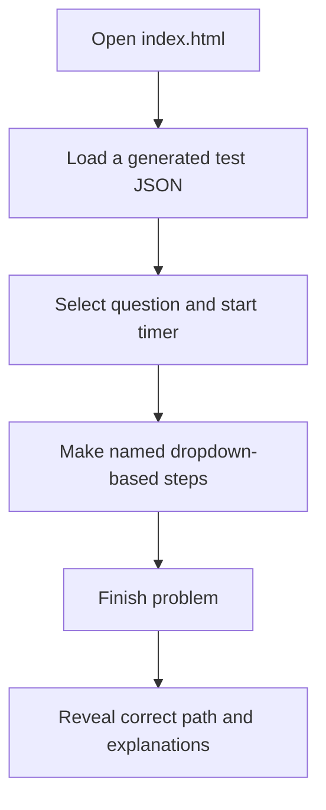

# Local offline guided test prep handoff

This package replaces the earlier hosted-platform concept with the much smaller local-only product Brent described.

## The decision in one sentence

Brent generates a complete JSON test file outside the app; Amy double-clicks a local `index.html`, loads that file, completes timed dropdown-based steps, and then reveals the authored solution path and explanations.

## What this package gives the engineer

| File | Use it for |
| --- | --- |
| `Guided_Test_Prep_Local_Offline_SOW_v0.2.md` | Scope, learner flow, deliverables, exclusions, acceptance gates, and commercial milestones. |
| `test-file.local.v1.schema.json` | The local file API contract. A generated test must conform to this format. |
| `engr206-local.test.example.json` | A fully realized ENGR 206 example with three problems, a 2D circuit visual, a constrained 3D visual, formulas, conversion, basic math, derivative action, and explanation-rich solution paths. |
| `mechanics-of-materials.local.test.example.json` | A fully realized Mechanics of Materials fixture with a double-lap bolt group, an axially loaded bar, and bilinear shear unloading. It uses only the existing schema and visual adapters. |

## What the engineer must build

The deliverable is a local application whose final output includes `index.html`. Amy must be able to double-click it on her own machine with no internet connection. The home screen opens a local JSON file with the browser file picker; it must use `FileReader`, not `fetch`, so it works under `file://`.

The runtime must:

1. render the selected test and let Amy choose a problem;
2. start, pause, and finish an elapsed timer;
3. let her choose formulas, basic math, conversions, derivatives, and final answers from dropdowns;
4. calculate outputs and automatically name them;
5. let her rename each value and reuse it in later dropdowns; and
6. reveal the pre-authored correct path and its explanation fields after she finishes.

## What Brent generates outside the app

For each new practice test, Brent uses this file contract to generate a finished `.json` file. The app does not need a problem generator, a profile editor, a database, an AI API, or any cloud service.

When creating a test file, use this instruction as the starting point:

> Produce one valid JSON object conforming to `guided-test-file.local/v1`. Create complete fixed problems only; do not use random ranges, templates, code, external image URLs, or executable expressions. Include every formula, given, target, declarative 2D or 3D visual, allowed operation, and full ordered `solutionPath`. Every solution step must explain `whyNow`, `whatToNotice`, `whyThisOperation`, `inputMeaning`, and `resultUse` in clear teaching language.

The samples are intentionally completed tests, rather than content-generator inputs. They are the exact sort of data the local app consumes.

## Why the Mechanics of Materials fixture fits the same API

No mechanics-specific app code or schema extension is required. The fixture proves the generic contract can cover a different subject using existing building blocks.

| Problem | Existing file-contract features used |
| --- | --- |
| Double-lap bolt-group shear stress | `diagram2d/v1`, a declared kN-to-N conversion, formula cards, and reusable area/stress outputs. |
| Axial bar elongation and strain | `scene3d/v1`, three declared conversions, formula cards, and reuse of the converted length and calculated elongation. |
| Bilinear shear stress-strain unloading | `diagram2d/v1`, formula cards, built-in add/subtract actions, and an explanation-rich path to residual strain. |

These are fixed client-provided fixtures. The contractor builds the offline runtime that reads them; creating additional problems remains outside the implementation scope.

## One small reliability rule that stays

No sign-in or security infrastructure is needed. The app should still interpret a finite calculation tree rather than run code stored in a JSON file. That keeps generated test files portable and prevents one malformed formula from crashing the local app.

## The experience Amy should get

The solution review is deliberately authored, not a live chatbot. It should say exactly why a derivative, conversion, or formula occurs next - for example, that a derivative comes first because the problem asks for the slope at a particular instant.
